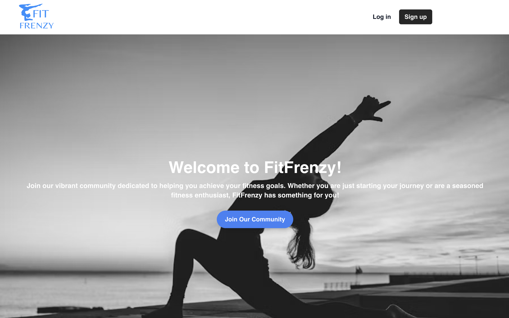

# FitFrenzy Frontend

**FitFrenzy, a fitness track application, is a frontend application designed to manage user authentication, profiles, quotes, and workouts. This application is built with Next.js and TypeScript, and it uses Docker for containerization and Google Cloud Run for deployment.**



## Table of Contents
- [Installation](#installation)
- [Usage](#usage)
- [Project Structure](#project-structure)
- [Environment Variables](#environment-variables)
- [Deployment](#deployment)
- [Contributing](#contributing)
- [License](#license)

## Key Features

- User authentication
  - Sign Up
  - Login
  - Forgot Password

- Profile management
  - Users can manage their profile details, such as name, email, profile picture, age, gender, weight, height.

- Workout logging
  - Users can log, modify, view and remove their workouts
  - Users can filter workouts based on various Date Ranges

- Nutrition tracking
  - Users can search for recipes and save them to their profile for easy access and meal planning.
    reference: https://www.edamam.com/

- Progress tracking
  - Users can track their weight and view in a line chart
  - Users can track their workout in pie and bar chart

- Motivational Quotes
  - This is intended to provide users with motivational quotes to inspire and encourage them in their fitness journey every time they login.

- Search Fitness exercise Videos
  - Users can search for fitness exercise videos to find instructional content and workout routines.
  - Recommendation of videos based on titles

- Admin role
    - Only users with admin role has access to view all the users and their profile. If required, user can all delete the user profile.

- Community Blog
    - In order to connect all the users together, a user can post a message and other users can reply to it.
    All posts are visible to all the users.
    - User can delete or update only their posts and replies.

## Tech Stack

- Framework: Next.js with TypeScript
- Containerization: Docker
- Deployment: Google Cloud Run
- Styling: Tailwind CSS
- State Management: React Context API

### Other Libraries and tools
- Icons: React Icons
- Charts: React Chart.js 2
- Date Picker: React Datepicker
- Video Player: React Player
- Font Management: Next Font
- Environment Variables: Dotenv
- Password Hashing: bcryptjs
- Authentication: jsonwebtoken


## Installation

Prerequisites:
- Node.js (>= 16.x)
- API Key and API ID for accessing Edaman Food Databse
- Postgres SQL
  (if cloud deployment required, )
- GCP with necessary permissions
- Docker to deploy on GCP 

Clone the repository:

```bash
git clone https://github.com/yourusername/fit-frenzy-frontend.git
cd fit-frenzy-frontend
```

Install dependencies:

```bash
npm install
```

Set up environment variables: Create a `.env` file in the root directory and add the necessary environment variables as specified in the Environment Variables section.

## Usage

To start the development server, run:

```bash
npm run dev
```

To build the project, run:

```bash
npm run build
```

To start the production server, run:

```bash
npm start
```

## Project Structure

```
.github/
  workflows/
    deployFrontend.yaml
.gitignore
package.json
app/
  components/
  context/
  exercise/
  fonts/
  globals.css
  layout.tsx
  login/
  nutrition/
  page.tsx
  profile/
  progress/
  register/
  workout/
Dockerfile
next-env.d.ts
next.config.ts
package.json
tailwind.config.ts
tsconfig.json
```

## Environment Variables

The following environment variables need to be set in the `.env` file:

- `NEXT_PUBLIC_API_URL`: The base URL for the API that the frontend application will communicate with. This is used to make network requests to the backend services.
- `NEXT_PUBLIC_EDAMAM_API_KEY`: The API key for accessing the Edamam API, which provides nutrition data and recipe information.
- `NEXT_PUBLIC_EDAMAM_API_ID`: The application ID for the Edamam API, used in conjunction with the API key to authenticate requests.
- `NEXT_PUBLIC_YOUTUBE_API_KEY`: The API key for accessing the YouTube API, which allows the application to search for and display fitness exercise videos.

## Deployment

The application is deployed using GitHub Actions and Google Cloud Run. The deployment workflow is defined in `deployFrontend.yaml`.

To deploy the application, push changes to the `main` branch or manually trigger the workflow using the GitHub Actions interface.

Currently it is deployed in https://fit-frenzy-frontend-630243095989.europe-west1.run.app/